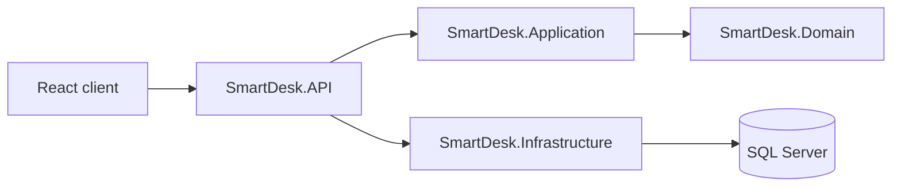

# Architecture

SmartDesk uses Clean Architecture to keep business rules independent of frameworks and delivery mechanisms.

Domain owns entities and enums; Application will own use cases and interfaces; Infrastructure owns EF Core SQL Server persistence; API owns HTTP delivery, middleware, observability, OpenAPI, and health checks.
